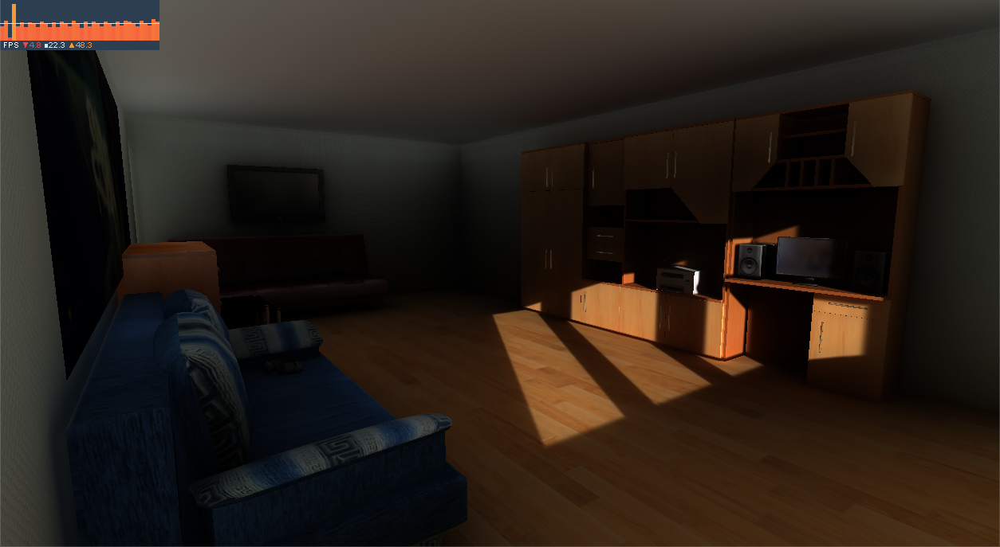

# Unity-SRP-VXGI
Voxel-based Global Illumination using Unity Scriptable Render Pipeline.

This project is my graduation thesis at Ho Chi Minh City University of Technology. Inspired by [sonicether/SEGI](https://github.com/sonicether/SEGI).

# Requirements
+ Unity 2018 (Experimental API). Using Unity 2019 would require slight modification to the code.
+ Shader Model 4.5 or newer.
+ Graphic API that supports geometry shader (this excludes Metal API).
+ Approximately 1GB of VRAM for highest voxel resolution setting.

# TODO
* [ ] **Figure out the correct indirect lighting equation**. Currently, the current indirect lighting equation is not mathematically correct, so I have to figure out the correct render parameters behind [the rendering equation](https://en.wikipedia.org/wiki/Rendering_equation).
* [ ] **Implement a better interlocked writing strategy**. Each voxel in the scene need to be shaded based on the physical properties of the material of the surface overlapping the voxel. However, multiple surfaces can overlap the same voxel, which leads to race condition when writing to the same voxel. The current implementation consumes 2.5 times the memory needed for storing voxel data because of current interlocked writing strategy.
* [ ] **Implement shadow mapping for the most important lights**. Shadow mapping will increase the accuracy of the visibility function and thus improve rendering quality. For other non-important lights, ray tracing through voxel volume is used to compute visibility between two points.
* [ ] **Implement anisotropic voxel**. This feature can prevent light bleeding more effectively than using isotropic counterpart and add more realism to the scene.
* [ ] **Implement voxel cascade**. This will extend the indirect lighting range without affecting nearby details, which is implemented in the game **The Tomorrow Children**.
* [ ] **Port to Unity 2019.x**. This project is implemented using experimental features in Unity 2018.3.f1. Unity 2019 offers API with slightly different names so the code must be changed for this version.
* [ ] **Support transparent material and refractive effect**. Deferred rendering pipeline doesn't support transparent material.
* [ ] **Implement screen space reflection**. Screen space reflection will be blended together with cone-traced reflection based on smoothness value for better quality.
* [ ] **Improve rendering performance at highest voxel resolution**.
